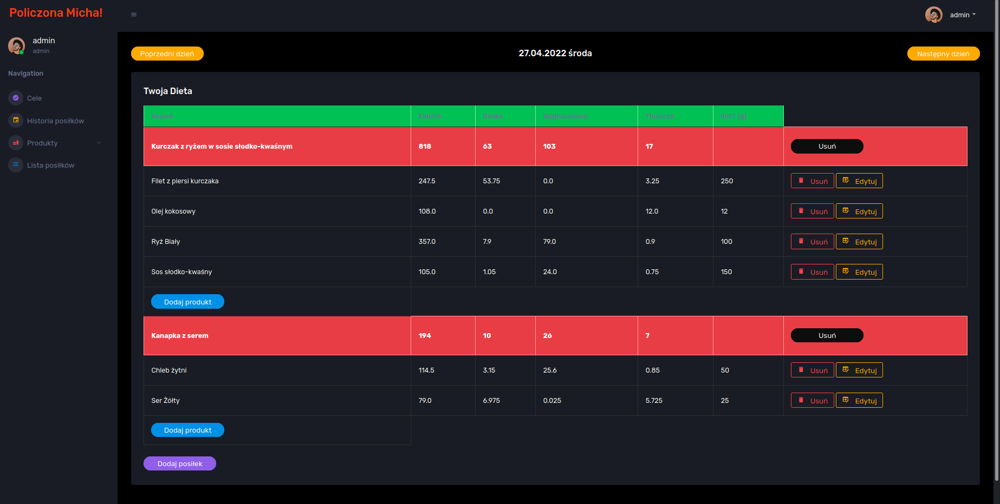
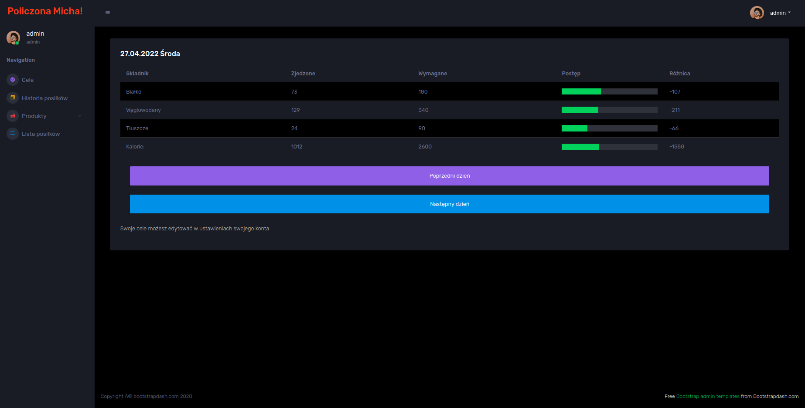

# Kilocalories Calculator - Final Workshop
> My project at the end of the "Java Developer" course at Coderslab. It is a web application that allows summation of the adopted macronutrients.
## Table of Contents
* [General Info](#general-information)
* [Technologies Used](#technologies-used)
* [Features](#features)
* [Screenshots](#screenshots)
* [Usage](#usage)
* [Project Status](#project-status)
* [Room for Improvement](#room-for-improvement)
* [Contact](#contact)

## General Information
- The program uses the bootstrap template
- The application counts the kilocalories and macronutrients from the entered meals.
- The user does not have to add up the nutritional values ​​of the product packaging each time
- Just add the ingredient once, then the app will calculate and record the values ​​for each meal
- The application displays the progress of the day in relation to the assumed nutritional goals

## Technologies Used
- Java
- Spring MVC
- Spring Data JPA
- Spring Security
- MySql
- JavaScript

## Features
List the ready features here:
- calculation of nutritional values
- adding products
- adding meals
- setting daily goals
- registration new users
- confirmation of new users via email
- editing all values ​​in the application
- editing password of user

## Screenshots

<!-- If you have screenshots you'd like to share, include them here. -->

## Usage
In order to run the application in the version without email verification, the repository must be encapsulated and opened in the IDE.
Create SQLDatabase with name:finalWorkshop.

Then run the main method of the class
`src / main / java / en / coderslab / SpringbootApplication.java`

Enter the following address in the browser: `http://localhost:8080/create-user`

the user "admin" has been created. His login details are:
user name: admin
password: admin

Now we can log in and use the application! ;)

`write-your-code-here`

To use the version with email verification, you must set up the email configuration.
the default configuration is for Gmail

We can change it in class
`src/main/java/pl/coderslab/account/email/MailConfiguration.java`

And in class
`src/main/java/pl/coderslab/account/email/MailAuthenticator.java`

## Project Status
Project is: in progress

## Room for Improvement
To do:
- saving user weight
- virtual fridge (suggesting meals based on the ingredients in fridge)

## Contact
Linkedin

